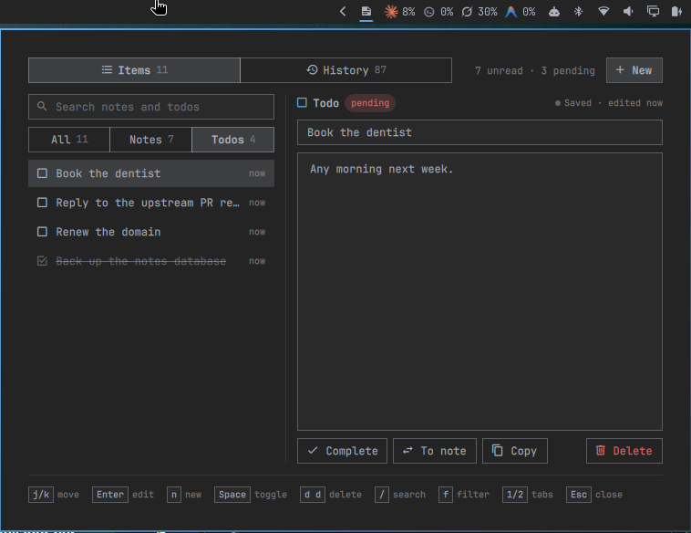

# Omanotes



Notes and todos in one keyboard-driven panel on the Omarchy bar. Everything is stored in a local SQLite database, and a History tab logs each change.

## Features

- One list for notes and todos. Unread notes and pending todos sort first, then the most recently updated.
- The right-hand pane is the editor: a title field and a body. Leaving the editor saves it.
- Keyboard-driven, with a hint bar that shows the keys for the current context.
- A History tab that logs every change (`added`, `edited`, `completed`, `reopened`, `converted`, `deleted`). Entries can be deleted one by one or cleared.
- The panel reloads when the database file changes, so edits from the IPC or from `sqlite3` show up without reopening it.
- An IPC target to add, list, toggle and remove items from scripts.

## Install

```sh
omarchy plugin add https://github.com/othavi0/omanotes.git --enable
```

## Remove

```sh
omarchy plugin remove othavi0.omanotes
```

## Keys

Items tab, list:

| Key | Action |
|---|---|
| `j` / `k`, `↓` / `↑` | Move the selection |
| `Enter`, `l`, `→`, `Tab` | Edit the selected item, or start a note draft when nothing is selected |
| `n`, `a` | New note draft |
| `Space`, `c` | Toggle status (read/unread, completed/pending) |
| `d` `d` | Delete. The second press must come within 2 seconds |
| `/` | Focus search |
| `f` | Cycle the filter: all, notes, todos |
| `Esc` | Cancel an armed delete, or close the panel |

Items tab, editor:

| Key | Title field | Body |
|---|---|---|
| `Enter` | Move to the body | Save and return to the list |
| `Shift+Enter` | | New line |
| `Tab` | Move to the body | Save and return to the list |
| `Shift+Tab` | Save and return to the list | Move to the title |
| `Esc` | Save and return to the list | Save and return to the list |
| `Shift+Esc` | Discard and return to the list | Discard and return to the list |
| `t` | On an empty draft title, switch between note and todo | |

A draft with a body and no title can't be saved. It stays open with the warning "New item needs a title" until you type a title or discard it.

Search field: `Enter`, `Tab` or `Shift+Tab` return to the list, `Esc` clears the search and returns. While a draft is open, they return to the draft's title instead.

History tab: `j` / `k` move, `d` `d` deletes an entry, `c` clears the whole history at once, `Esc` cancels an armed delete or closes the panel.

## IPC

The target is `scratchpad` (a legacy name, see [ADR-0003](docs/adr/0003-keep-the-scratchpad-name-for-data-and-ipc.md)). Every method takes all its arguments, so pass `""` for an empty body:

```sh
qs -p /usr/share/omarchy/shell ipc call scratchpad addNote "Buy coffee" ""
qs -p /usr/share/omarchy/shell ipc call scratchpad addTodo "Renew the domain" "Due day 30"
qs -p /usr/share/omarchy/shell ipc call scratchpad listTodos
```

| Method | Returns |
|---|---|
| `addNote(title, body)`, `addTodo(title, body)` | `{"ok":true}` for a non-empty title, `{"ok":false,"error":"title is required"}` otherwise. The write is dropped if the database has not finished starting |
| `listNotes()`, `listTodos()` | JSON array of `{id, type, title, body, status}` from the bar widget's last reload |
| `toggleTodo(id)` | Flips the status of any item, note or todo, and returns `{"ok":true}`, or `{"ok":false,"error":"item not found: <id>"}` |
| `remove(id)` | Deletes an item and returns `{"ok":true}`, even for an unknown id |
| `clearHistory()` | Deletes every history entry and returns `{"ok":true}` |
| `open()`, `close()`, `show()`, `hide()`, `toggle()` | Nothing. They open, close or toggle the panel |
| `ping()` | `ok` |

Writes are asynchronous. A `list*` call right after an `add*` can miss the new item until the panel reloads.

## Data

The database is `$XDG_DATA_HOME/omarchy/scratchpad.db` (`~/.local/share/omarchy/scratchpad.db` by default), stored as plain SQLite. The schema is `SCHEMA` in `data/Db.js`: an `items` table for notes and todos and a `history` table. The plugin applies it at start, and the test harness seeds its database from the same constant.

## Development

- `npm run validate` runs `omarchy plugin validate .`.
- `npm test` runs `node --test test/`, then `test/render.sh` and `test/behavior.sh`. The last two start Quickshell offscreen and need `qs`, `sqlite3` and the Omarchy shell installed.

Design decisions are in [`docs/adr/`](docs/adr/) and the project vocabulary is in [`CONTEXT.md`](CONTEXT.md).

## License

[Apache License 2.0](LICENSE). See [NOTICE](NOTICE) for copyright and attribution.
