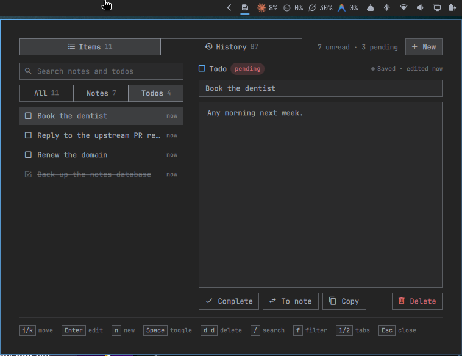

# Omanotes

Notes, todos and alarms in one panel on the Omarchy bar, for Omarchy users who want a scratch list and an alarm clock without leaving the desktop. Everything stays in a local SQLite database, and a History tab logs each change to an item.



## Features

- One list for notes and todos. Unread notes and pending todos come first, read notes and completed todos after them, and you set the order inside each of those two blocks by dragging.
- The right-hand pane is the editor: a title field and a body. Leaving the editor saves it.
- Driven by the mouse, with Esc to close the panel.
- An Alarms tab. Each alarm has a time, a label, the days it repeats, a snooze length and a ring length. The bar shows the next alarm, and a due alarm rings on a card under the bar.
- A History tab that logs every change to an item (`added`, `edited`, `completed`, `reopened`, `converted`, `deleted`). Entries can be deleted one by one or cleared. Alarms are not logged.
- The panel reloads when the database file changes, so edits from the IPC or from `sqlite3` show up without reopening it.
- An IPC target to add, list, toggle and remove items from scripts.
- A Settings tab for the alarm sound, the new-alarm defaults, the version and how to update, how long history is kept and a backup of the database.

## Requirements

- The Omarchy shell. Omanotes is a shell plugin with a bar widget and a service.
- An x86_64 or aarch64 machine with glibc 2.34 or later.
- `libsqlite3.so.0` from SQLite 3.44 or later.
- For the alarm sound only, one of `pw-play`, `paplay`, `mpv` or `ffplay` in `/usr/bin`. A player elsewhere in your `PATH` is not used. Without any of them, an alarm rings silently.
- `wl-copy` in `/usr/bin` (the `wl-clipboard` package, part of Omarchy) for the **Copy** button of Settings.

A current Arch Linux, the base of Omarchy, has all of them. On a machine without glibc 2.34 or `libsqlite3.so.0`, the panel says it cannot run the database helper and names the file it tried.

Omanotes and omatodolist cannot be enabled together. Both register the `scratchpad` IPC target and write the same database file (see [ADR-0003](docs/adr/0003-keep-the-scratchpad-name-for-data-and-ipc.md)).

## Install

```sh
omarchy plugin add https://github.com/othavi0/omanotes.git --enable
```

## Update

Omanotes does not update itself. To update it, run:

```sh
omarchy plugin update othavi0.omanotes
omarchy restart shell
```

`omarchy plugin update` shows the changes and asks before it pulls. Run `omarchy restart shell` only after it prints `Updated othavi0.omanotes.`: the shell's own reload keeps the code it already compiled, so only a restart loads the new version. The update also exits 0 when there is nothing new or when you answer no, and a restart then would only stop an alarm that rings. The **Updates** page in Settings shows both commands, and its **Copy** button copies the update alone.

## Remove

```sh
omarchy plugin remove othavi0.omanotes
```

Removing the plugin keeps your data: the database `~/.local/share/omarchy/scratchpad.db`, the backups `scratchpad-<date>.db` next to it, and the `-wal`, `-shm` or `-journal` file SQLite can leave beside them. If `XDG_DATA_HOME` is set, they are in `$XDG_DATA_HOME/omarchy/` instead. `scratchpad.db` is the file omatodolist used too ([ADR-0003](docs/adr/0003-keep-the-scratchpad-name-for-data-and-ipc.md)), so if you still use omatodolist, keep it. To delete them, run this in bash or zsh. It prints each file it deletes, and deletes nothing more when there is no backup. If the folder does not exist, `find` says so and deletes nothing:

```sh
find "${XDG_DATA_HOME:-$HOME/.local/share}/omarchy" -maxdepth 1 -name 'scratchpad*.db*' -print -delete
```

Version 1.1.0 and older kept the state of their self-update in `~/.local/state/omanotes/` (or `$XDG_STATE_HOME/omanotes/`). Nothing reads it any more, and you can delete the folder:

```sh
rm -r "${XDG_STATE_HOME:-$HOME/.local/state}/omanotes"
```

## Using the panel

Everything is on screen. `Esc` closes the panel from anywhere in it, and closing saves what the editor holds.

- **New** opens a menu with Note and Todo. Each opens a draft of that type in the editor.
- Click a row to open it in the editor. Its box toggles the status. The search field and the All, Notes and Todos buttons narrow the list.
- Drag a row, from anywhere on it, to put it somewhere else in its block. The drag starts after the pointer moves 6 px, so a click still opens the row, or toggles it on the status icon. A new or reopened item goes to the top of the first block, and an item you mark read or complete goes to the top of the second. Editing or converting an item leaves it where it is. In Notes or Todos, a dropped row lands next to the rows you see and the hidden ones keep their places. Rows don't drag while the search field has text.
- The editor saves when you leave it: another row, the Save button, another tab or closing the panel. Discard throws the changes away. In the title, `Tab` and `Enter` move to the body; in the body, `Enter` starts a new line and `Shift+Tab` goes back to the title.
- A draft with a body and no title can't be saved. It stays open with the warning "New item needs a title" until you type a title or discard it.
- The buttons under the editor toggle the status, convert between note and todo, copy the item and delete it.
- In History, a trash button shows on the row under the pointer.

Delete, the History trash and Clear history each need a second click on the same button, which reads Confirm, within 2 seconds. Selecting another row, switching tabs or closing the panel cancels the first click.

The History tab shows a note marked read as `read` and a note marked unread as `unread`. The database stores them as `completed` and `reopened`, like a todo's.

## Alarms

Open the panel, pick **Alarms** and press **+ Alarm**, or choose Alarm in the New menu. Type the time as `07:30` or `0730`, then set a label, the days it repeats, how long a snooze lasts and how long it rings. Leaving the editor saves the alarm. An alarm with no repeat days rings once and switches itself off. The switch on each row turns the alarm off and on, and switching it on arms it from now, so a time that passed while it was off does not ring.

The bar chip shows the next alarm: `07:30` when it is today, `Sat 07:30` on another day, and the snooze time after a snooze. When an alarm is due, a card drops under the bar on every screen, the chip turns to a bell with the alarm's label (its time when it has no label, or a count when several ring), and a sound loops. Snooze or Stop it on the card, or click the chip. If you do nothing, the alarm snoozes itself after its ring length, up to 3 times. The panel stays closed and the card takes no keyboard focus.

An alarm found more than 10 minutes late, after the computer slept, does not ring. You get one notification that lists every missed alarm.

The sound is one of the freedesktop sounds in `/usr/share/sounds/freedesktop/stereo/` or a file you pick, set in Settings, played by the first of `pw-play`, `paplay`, `mpv` and `ffplay` that is installed. A picked file that is gone plays the default alarm clock. When nothing can play it, the alarm rings silently and the journal says so.

The alarms are kept once per shell by the plugin's service, so several monitors share one clock and one ring. In a shell without the service, the tab says so and the chip shows the note glyph alone.

## Settings

The gear at the end of the tabs opens Settings. Changes save as you make them.

- **Alarm sound** switches the sound on or off, picks one of six sounds or a file of your own, and sets the volume. The play button on a row and **Test** play the sound once, at the volume shown; they need the plugin's service.
- **Alarms** sets the snooze and ring lengths a new alarm starts with. Alarms you already have keep their own.
- **Updates** shows the version that runs, the two commands that update the plugin, and **Copy**, which copies the update. The restart comes after the update prints `Updated othavi0.omanotes.`. The plugin never checks for or downloads updates by itself.
- **History** keeps entries forever, 90 days or 30 days. A shorter choice that removes entries needs a second click, and older entries are removed again each time the panel opens.
- **Data** shows where the database is and its size. **Back up now** copies it next to itself as `scratchpad-<date>.db`, and a second backup the same day replaces the first.

## IPC

The target is `scratchpad` (a legacy name, see [ADR-0003](docs/adr/0003-keep-the-scratchpad-name-for-data-and-ipc.md)). Every method takes all its arguments, so pass `""` for an empty body:

```sh
qs -p /usr/share/omarchy/shell ipc call scratchpad addNote "Buy coffee" ""
qs -p /usr/share/omarchy/shell ipc call scratchpad addTodo "Renew the domain" "Due day 30"
qs -p /usr/share/omarchy/shell ipc call scratchpad listTodos
```

| Method | What it does | Replies |
|---|---|---|
| `addNote(title, body)`, `addTodo(title, body)` | Adds a note or a todo | `{"ok":true}`, `{"ok":false,"error":"title is required"}` for an empty title |
| `listNotes()`, `listTodos()` | Lists every note or every todo in the panel's order, from the bar widget's last reload | A JSON array of `{id, type, title, body, status}` |
| `toggleStatus(id)` | Toggles the status of any item, note or todo | `{"ok":true}`, `{"ok":false,"error":"item not found: <id>"}` |
| `toggleTodo(id)` | The old name of `toggleStatus`, kept for existing scripts. It also toggles notes | Same as `toggleStatus` |
| `remove(id)` | Deletes an item | `{"ok":true}`, `{"ok":false,"error":"item not found: <id>"}` |
| `clearHistory()` | Deletes every history entry and keeps the items | `{"ok":true}` |
| `ping()` | Checks that the bar widget answers | `{"ok":true}` |
| `open()`, `close()`, `show()`, `hide()`, `toggle()` | Opens, closes or toggles the panel. `show` and `hide` are the same as `open` and `close` | Nothing |

Every method except `ping` and the panel methods can also reply `{"ok":false,"error":"not ready"}` while the database is starting.

Writes are asynchronous. `{"ok":true}` means the write is queued. A write that fails later is logged to the journal with the `omanotes db:` prefix. `toggleStatus`, `toggleTodo` and `remove` look the id up in the bar widget's last reload, so an item added or deleted a moment before can still be missing or found. A `list*` call right after an `add*` can miss the new item until the bar widget reloads.

## Data

The database is `$XDG_DATA_HOME/omarchy/scratchpad.db` (`~/.local/share/omarchy/scratchpad.db` by default), stored as plain SQLite. The schema is the list of steps in `db/Schema.cs`: an `items` table for notes and todos with a `position` for the order, a `history` table, a folded copy of each title and body for search, and a `settings` table with one row, an `alarms` table whose instants are epoch milliseconds and whose `days` is a bitmask of weekdays with bit 0 for Sunday. Each run of `omanotes-db` first runs every step above the database's `user_version`, in one transaction (ADR-0011), so a file created or restored by hand is brought up to date the next time the plugin reads it. The panels, the IPC and the service share one copy of what the plugin read, and a change to the file is one run of `omanotes-db` whatever the number of monitors (ADR-0018). An alarm row inserted with `sqlite3` is armed at its insert time, so it does not ring for a time that passed before it existed. The service writes the whole row each time it changes an alarm, so a `sqlite3` edit to that alarm made just before a service write lands, or while a failed write waits for its retry, is overwritten. A value stored out of range by hand, such as a fractional hour, is rounded into range and written back with the next change.

## Privacy and network

Omanotes does not use the network. Nothing in it fetches, uploads or checks for updates, and it opens no web address. What was measured:

- The shipped QML and JavaScript contain no network API and no URL.
- `omanotes-db <protocol> selftest <dir>`, which creates a database on disk, migrates it, writes to it and reads it back, exits 0 inside `unshare -rn`, a namespace with no network. `<protocol>` is `PROTOCOL` in `data/Db.js`.
- `bin/omanotes-db.x86_64` and `bin/omanotes-db.aarch64` import no `socket`, `connect`, `bind`, `sendto` or `getaddrinfo` symbol (`readelf --dyn-syms`), and the x86_64 one links only `libc`, `libm` and the loader. Its strings name `libssl` symbols, which the .NET runtime it is built with can load on demand, so this check alone does not show that the binary has no network code.

The files Omanotes reads and writes:

- `~/.local/share/omarchy/scratchpad.db`, or `$XDG_DATA_HOME/omarchy/scratchpad.db`: your notes, todos, history, alarms and settings. `omanotes-db` creates the folder and the file when they are missing.
- `scratchpad-<date>.db` in the same folder, written only by **Back up now**, through a `scratchpad-<date>.db.tmp` file it then renames.
- The alarm sound: a file in `/usr/share/sounds/freedesktop/stereo/` or the file you picked, read by the player.

The programs Omanotes starts, each by its full path:

- `bin/omanotes-db.<machine>` from the plugin folder, for every read and write.
- `/usr/bin/bash` running the sound script, which starts the first of `pw-play`, `paplay`, `mpv` and `ffplay` in `/usr/bin`, through `/usr/bin/setpriv` for a ringing alarm so the player ends with the shell.
- `/usr/bin/wl-copy` for **Copy** in Settings.
- `/usr/bin/xdg-open` for **Open folder** in Settings.
- Omarchy's `omarchy-notification-send`, for a missed alarm, and `omarchy-file-select`, when you pick a sound file, from `$OMARCHY_PATH/bin` (`/usr/share/omarchy/bin` by default).

## About omanotes-db

`omanotes-db` is the only process that talks to the database. Every SQL statement and every schema migration lives in it. It is a C# program compiled ahead of time with NativeAOT, and its source is in [`db/`](db/). The plugin starts one `omanotes-db` process per request and writes the request on its standard input, so the text of your notes never appears in a command line. Each process exits when it has answered.

The plugin ships it already built in `bin/`, as `bin/omanotes-db.x86_64` and `bin/omanotes-db.aarch64`, so installing Omanotes needs no .NET SDK and no build step. [`bin/BUILD.json`](bin/BUILD.json) records the SHA-256 of each binary, the hash of the source it was built from and the toolchain versions.

To check that the binaries are the ones `bin/BUILD.json` describes and that `bin/BUILD.json` matches the source in `db/`, run:

```sh
tools/verify-bin.sh --check
```

To build both binaries again from `db/` in a temporary folder and compare them byte for byte with `bin/`, run:

```sh
npm run verify:bin:rebuild
```

The rebuild runs in docker, in the `archlinux` image and the toolchain that `tools/toolchain.env` pins, and it exits with code 2 when that toolchain is not the one `bin/BUILD.json` records. The `verify-bin` workflow runs the same rebuild on every pull request and every push to `main`, so each commit of `main` has a check run that says whether its `bin/` is what its `db/` makes.

## Development

- `npm run validate` runs `omarchy plugin validate .`.
- `npm test` runs `node --test test/`, then `test/render.sh`, `test/behavior.sh`, `test/panel.sh`, `test/alarm.sh`, `test/startup.sh` and `test/teardown.sh`. The unit tests need `sqlite3` and run the committed binary for this machine. One of them runs `tools/verify-bin.sh --check`, which fails when `bin/` does not match `db/`. The other six start Quickshell offscreen and need `qs`, `sqlite3` and the Omarchy shell installed.
- `npm run build:db` runs `tools/build.sh`, the only writer of `bin/`, inside the docker toolchain of `tools/toolchain.env`. It builds both architectures and records their hashes and the toolchain in `bin/BUILD.json`. Commit a change to `db/` together with the rebuilt `bin/`.

Design decisions are in [`docs/adr/`](docs/adr/), the project vocabulary is in [`CONTEXT.md`](CONTEXT.md), and the layout and rules of the code are in [`docs/development.md`](docs/development.md).

## License and credits

Omanotes is licensed under the [Apache License 2.0](LICENSE). It started as a copy of omatodolist by Cailan Sacks (Apache License 2.0), and its alarm scheduling and player chain are adapted from Chime by nousd (MIT License). [NOTICE](NOTICE) holds the copyright and attribution of both.
